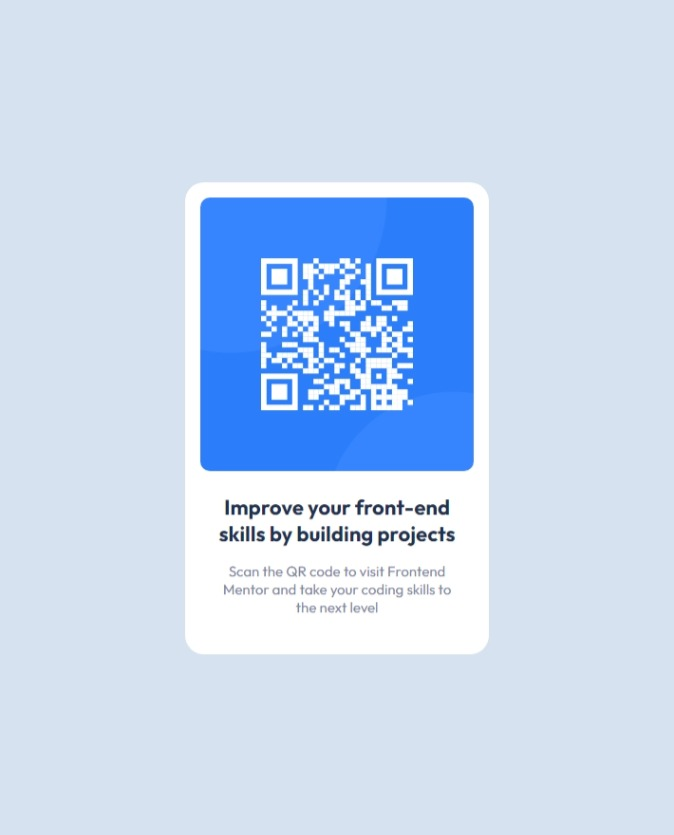

# Frontend Mentor - QR code component solution

This is a solution to the [QR code component challenge on Frontend Mentor](https://www.frontendmentor.io/challenges/qr-code-component-iux_sIO_H).

## Table of contents

- [Overview](#overview)
  - [Screenshot](#screenshot)
  - [Solution](#solution)
  - [Links](#links)
- [My process](#my-process)
  - [Built with](#built-with)
  - [Useful resources](#useful-resources)
- [Author](#author)

## Overview

### Screenshot

Finished Project


### Solution

HTML

```<body>
    <div class="card">
      
      <h3 class="text heading">
        Improve your front-end skills by building projects
      </h3>
      <p class="text paragraph">
        Scan the QR code to visit Frontend Mentor and take your coding skills to
        the next level
      </p>
    </div>
  </body>
```

CSS

```
  body {
    min-height: 100vh;
    text-rendering: optimizeSpeed;
    display: flex;
    justify-content: center;
    align-items: center;
    background-color: hsl(212, 45%, 89%);
    font-family: 'Outfit', sans-serif;
  }

  .card {
    background-color: hsl(0, 0%, 100%);
    padding: 16px;
    border-radius: 20px;
  }

  .qr-code {
    width: 288px;
    height: 288px;
    margin-bottom: 24px;
    border-radius: 10px;
  }

  .text {
    max-width: 250px;
    text-align: center;
    margin: 0 auto;
  }

  .heading {
    font-size: 22px;
    font-weight: 700;
    margin-bottom: 16px;
    color: hsl(218, 44%, 22%);
  }

  .paragraph {
    margin-bottom: 24px;
    font-weight: 400;
    font-size: 15px;
    color: hsl(220, 15%, 55%);
  }
```

### Links

- Live Site URL: [QR Code](https://wasituf.github.io/qr-code-component)

## My process

I started this project by looking through the design images and style guide. I first imported the design image in Figma to get a sense of the dimensions and radius and then went on from there. The solution involves creating a card that includes an image and 2 text elements. The card is centered on the screen and so are the texts inside it. Both the card and the image has a border radius and the card also has a padding to match the design. The only place I was stuck a little bit was containing the text to match the image. I ultimately fixed it with a max-width property of 250px on both the texts.

### Built with

- Semantic HTML5 markup
- CSS custom properties
- Flexbox

### Useful resources

- [Modern CSS Reset](https://piccalil.li/blog/a-modern-css-reset/) - This is the best CSS reset I've found so far. It is really handy for starting out any project and I recommend trying it out. I tweeked it a little bit to conform it to my use case.

## Author

- Linkedin - [@wasituf](https://linkedin.com/in/wasituf)
- Frontend Mentor - [@wasituf](https://www.frontendmentor.io/profile/wasituf)
- Twitter - [@wasituf](https://www.twitter.com/wasituf)
